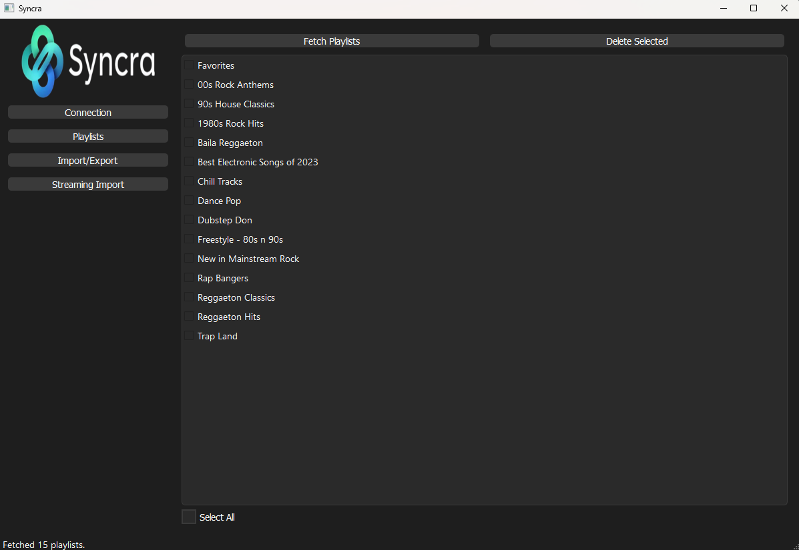

## Syncra

### Syncra is a powerful and intuitive application designed to manage your Plex playlists effortlessly. With a modern and user-friendly interface, it allows you to:

- Import .m3u and .m3u8 playlists into Plex.
- Export your Plex playlists to .m3u files.
- Delete unwanted playlists from your Plex server.
- Convert playlists from popular streaming services like Spotify, Deezer, and Tidal directly into Plex playlists.

